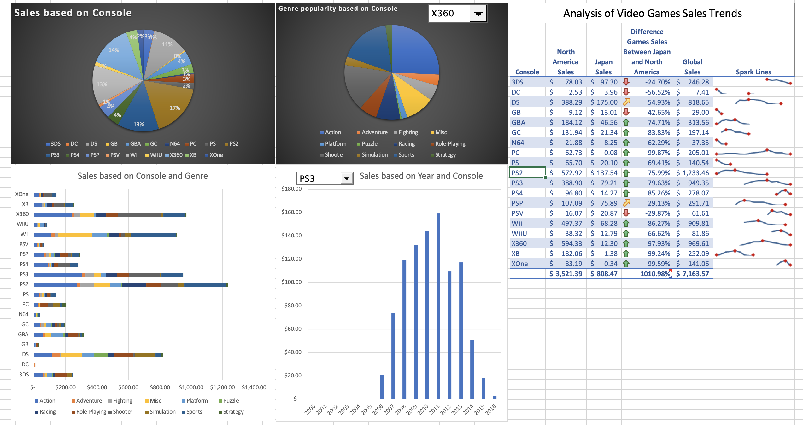

# Games Analysis
## Dashboard of Video Game Data 

This is video games sales data from the years 2000 to 2016 taken from Kaggle. The data is based on all the games made for consoles available during those years. In order to get a glimpse of the video game market during those years, I created a dashboard. There are two dynamically refreshing charts, a pie chart showing the most popular game genre made with a dropdown down menu to pick between consoles, and a bar graph showing global video game sales data based on the year using a dynamic dropdown menu to pick between consoles, to show you the exact year what console was popular. Next we have two static graphs showing console popularity based on game sales, and a clustered bar graph showing global game sales based on genre and console, showing the popularity of console and the genre for the console. Lastly we have a chart comparing two top game-consuming regions - Japan and North America - in percentages. As expected, American consoles do better in America and Japanese consoles did better in Japan at first until they caught wind in America with the GameBoy and the Wii. Next we have another glimpse at the global sales based on console. Lastly we have sparklines based on console and yearly games sales. 

